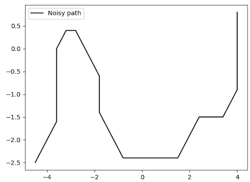

# Localization
Implement Kalman Filter and Particle Filter to localize the PR2 robot with the given path.


# About the project
EECS 498 Algorithmic Robotics - Full 2021

Prof. Dmitry Berenson

# Getting started

## Install necessary packages
We use the following packages in this project: `numpy`, `scipy`, `pybullet`, and `matplotlib`. 
```
$ bash install.sh
```

## Generate the data
We assume we already has a path which includes motion noise (i.e., `data_path.pickle`). This path is a N by 3 matrix, which each row represents a state.



### Control and motion noise generation
We obtain the control at each time step by generaing the motion noise and solving the motion model. By running this command, you will have `data.pickle`. This contains controls which is a N by 2 matrix, each row represents a control. Note that this ideal path is not involve in the preojct, just for visualization.
```
$ python motion.py
```


### Measurement generation
To fairly compare algorithms with the same measurements, we obtain the measurements of all states. By running this command, you will update `data.pickle`. This contains measurements which is a N by 2 matrix, each row represents a measurement. Note that we implement several distribution (e.g., Gaussian, triangular, and Rayleigh), which you can specify in the file.
```
$ python sensor.py
```


## Run KF and PF

After having controls, measurements, and the path, we can start to run the filtering algorithms.
### Kalman Filter

By running this command, you will see a figure containing the estimated path (blue) and the real path (black).
```
$ python kalman_filter.py
Execution time:  0.010622262954711914
Error:  20.401129962175126
```


### Particle Filter

By running this command, you will see a figure containing the estimated path (red) and the real path (black).
```
$ python particle_filter.py 
Execution time:  4.653516054153442
Error:  7.694496798550877
```


## Compare KF and PF
Besides plotting the path on the xy-plane, we can also simulate the PR2 robot in the given enviroment.
```
$ python demo.py
Execution time:
KF:  0.18025827407836914
PF:  12.547127723693848
Error:
KF:  20.062203182620284
PF:  7.642154967053671
```


# Contact

Chien-Lung Chou ([lungchou@umich.edu](lungchou@umich.edu))

Wan-Yi Yu ([wendyu@umich.edu](wendyu@umich.edu))